[Eng](#centralized-requirements-model-setup-instructions) | [Rus](#инструкция-по-настройке-централизованной-модели-требований)

<h1>Centralized Requirements Model Setup Instructions</h1>

In order to set up a centralized requirements model and allow the development and/or systems analysis team to work on the same requirements, as well as ensure version control of requirements, the following steps need to be taken:

<ol>
<h2>Configure MySQL Repository and Connections to It</h2>

Install MySQL Server - see the instructions on the [Dev Mysql](https://dev.mysql.com)
> :pencil: There is nothing complicated in setting up and configuring the server for our needs, but if you have any questions, write them down and I'll try to collect and add answers to the most popular questions here</li>

<li>
Create a Database::

``` mysql
CREATE DATABASE ea_new;
```

``` mysql
mysql> create database ea_new
[2023-03-17 15:49:25] 1 row affected in 12 ms
```
</li>

<li>Create a User for Enterprise Architect:</li>

``` mysql
CREATE USER 'ea_user'@'%' IDENTIFIED BY 'password';
```

``` mysql
ea_new> CREATE USER 'ea_user'@'%' IDENTIFIED BY 'password'
[2023-03-17 16:03:55] completed in 20 ms
```

<li>Grant permissions to the user:</li>

``` mysql
GRANT ALL ON ea_new.* TO `ea_user`@`%`;
```

``` mysql
ea_new> GRANT ALL ON ea_new.* TO `ea_user`@`%`
[2023-03-17 16:07:08] completed in 11 ms
```

<li>Deploy the MySQL Repository for Enterprise Architect - a database for the requirements model</li>

> :grey_exclamation:
> - Run SQL scripts according to the [instructions on the website](https://www.sparxsystems.com/enterprise_architect_user_guide/8.0/projects_and_teams/createanewmysqlrepository.html)
> - You can get the scripts [here](https://www.sparxsystems.com/resources/corporate/index.html#sql_scripts)
> - The names of the SQL script files were valid at the time of writing and may have changed
<ol>
<li>Run the script to create the repository structure

``` mysql
source EASchema_1558_MySQL.sql;
```
</li>
<li>Run the repository initialization script
``` mysql
source EABase_1558_MySQL.sql;
```
</li>
</ol>

<li> 

Configure ODBC according to the [instructions](https://www.sparxsystems.com/enterprise_architect_user_guide/8.0/projects_and_teams/setupmysqlodbcdriver.html)
<ol>
<li>Run the configuration locally on the PC from which you will work in Enterprise Architect

> Run the configuration locally on the PC from which you will work in Enterprise Architect:
> ``` 
> C:\Windows\SysWOW64\odbcad32.exe
> ```

Select "System DSN" and click "Add"
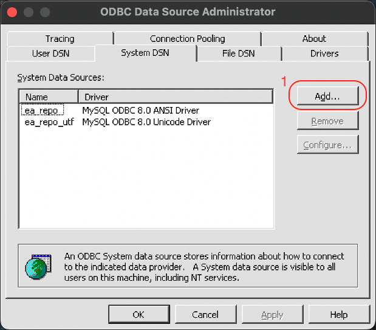
</li>
<li>Enter connection parameters:

- Enter the connection address
- Enter user data and select the schema created earlier
- Select the "Connection" tab and check the "Allow big result sets" checkbox
</ol>

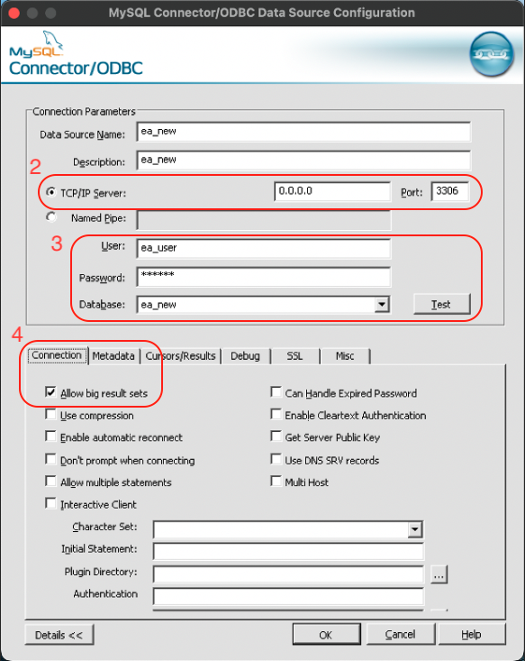
</li>
<li>Select the "Cursors/Results" tab and check the "Return matched rows instead of affected rows" checkbox

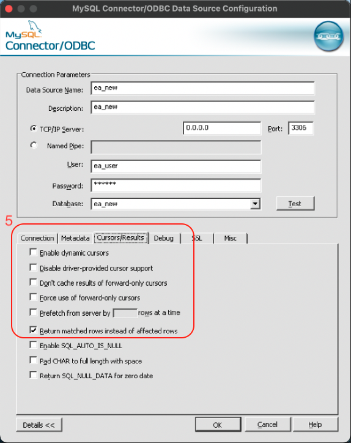
</li>
</ol>

<ol>
<h2>Configure Enterprise Architect<</h2>
<li>Configure the connection to the model in EA:

- Launch Enterprise Architect locally
- Click "Open Project"
- Choose "Connect to Server" and then "Connection Wizard"

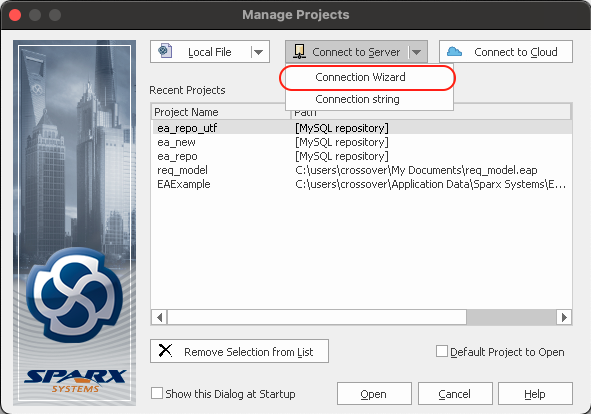
</li>
<li>Go to the "Connection" tab, select the ODBC connection we have set up, fill in the connection details, and choose the schema:

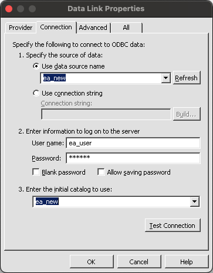
</li>

<li>Configure auto-numbering for Use Case and Requirements entities
<ol>
<li>Select "Settings" -> "Auto Names and Counters" on the "Configure" tab

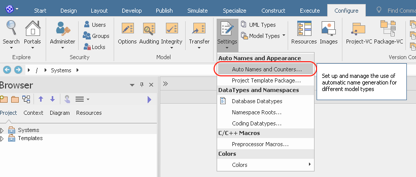
</li>
<li>Configure auto-numbering for Use Case:

>- Prefix: "UC-"
>- Counter: "00001"
>- Suffix: ". "
>- Check the "Apply on creation" checkbox
   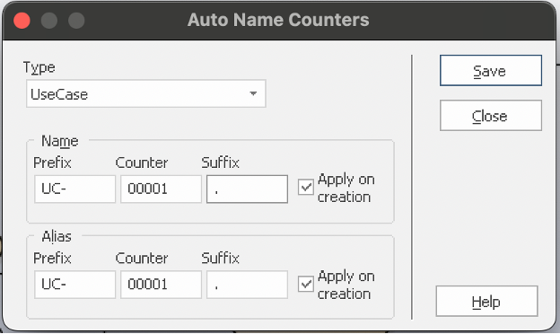
</li>
<li>Configure auto-numbering for Requirements:

>- Prefix: "Req-"
>- Counter: "00001"
>- Suffix: ". "
>- Check the "Apply on creation" checkbox
   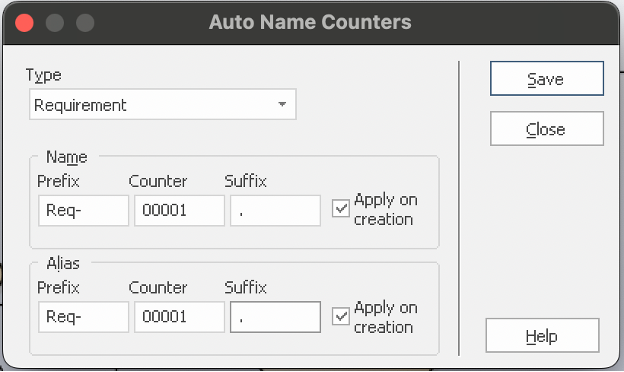
</li>
</ol>
</li>
<li>Configure access to the centralized requirements model

- Select "Administer" -> "Enable Security" on the "Configure" tab
  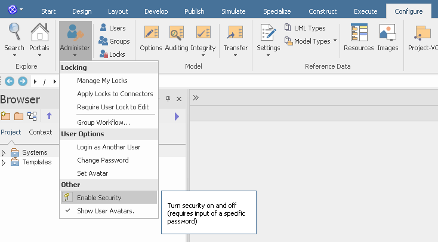
- Enter the Security key
  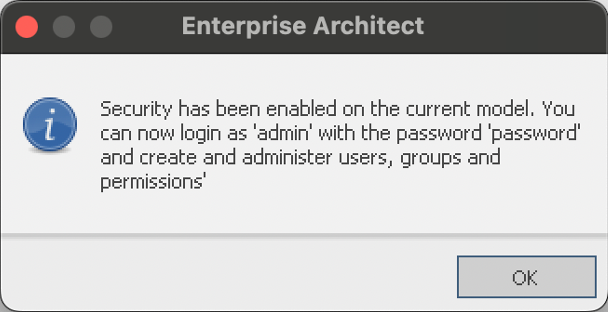
</li>
<li>Configure users in the centralized requirements model

- Select "Security" -> "Users" on the "Configure" tab
  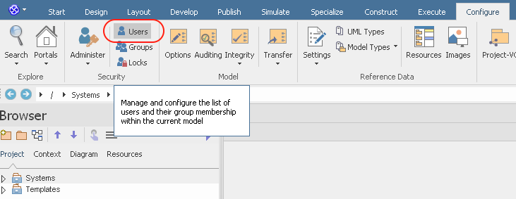
- Configure the necessary permissions
  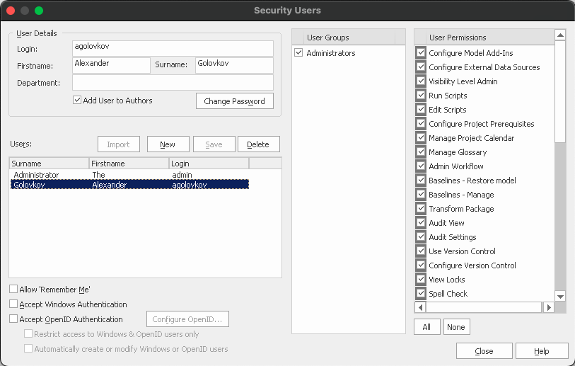
</li>
</ol>

---

<h1>Инструкция по настройке централизованной модели требований</h1>

Для того, чтобы настроить централизованную модель требований, позволить команде разработки и/или системного анализа работать над одними требованиями и обеспечить версионирование требований, необходимо выполнить следующие шаги:
<ol>
<h2>Настроить MySQL репозиторий и коннекты к нему</h2>

Установить MySQL Server - смотрите инструкции на сайте [Dev Mysql](https://dev.mysql.com)
> :pencil: В установке и настройке сервера для наших нужд нет ничего сложного, но если будут вопросы - пишите, постараюсь все собрать и добавить ответы на самые популярные вопросы сюда</li>

<li>
Создать Базу Данных:

``` mysql
CREATE DATABASE ea_new;
```

``` mysql
mysql> create database ea_new
[2023-03-17 15:49:25] 1 row affected in 12 ms
```
</li>

<li>Создать пользователя для Enterprise Architect:</li>

``` mysql
CREATE USER 'ea_user'@'%' IDENTIFIED BY 'password';
```

``` mysql
ea_new> CREATE USER 'ea_user'@'%' IDENTIFIED BY 'password'
[2023-03-17 16:03:55] completed in 20 ms
```

<li>Выдать пользователю права:</li>


``` mysql
GRANT ALL ON ea_new.* TO `ea_user`@`%`;
```

``` mysql
ea_new> GRANT ALL ON ea_new.* TO `ea_user`@`%`
[2023-03-17 16:07:08] completed in 11 ms
```

<li>Развернуть MySQL репозиторий для Enterprise Architect - базу для хранения модели требований</li>

> :grey_exclamation:
> - Накатить SQL-скрипты согласно [инструкции на сайте](https://www.sparxsystems.com/enterprise_architect_user_guide/8.0/projects_and_teams/createanewmysqlrepository.html)
> - Сами скрипты можно взять [здесь](https://www.sparxsystems.com/resources/corporate/index.html#sql_scripts)
> - Название файлов SQL-скриптов действительно на момент написания инструкции и могло изменится
<ol>
<li> Выполнить скрипт для создания структуры репозитория

``` mysql
source EASchema_1558_MySQL.sql;
```
</li>
<li> Выполнить скрипт инициализации репозитория

``` mysql
source EABase_1558_MySQL.sql;
```
</li>
</ol>

<li> 

Настроить odbc по [инструкции](https://www.sparxsystems.com/enterprise_architect_user_guide/8.0/projects_and_teams/setupmysqlodbcdriver.html)
<ol>
<li> Запустить настройку локально на PC, с которого будем работать в Enterprise Architect

> Для меня работает только x32, поэтому я запускаю с помощью Win + R и адреса:
> ``` 
> C:\Windows\SysWOW64\odbcad32.exe
> ```

Выбрать "System DSN" и нажать "Add"

</li>
<li> Ввести параметры подключения:

- Ввести адрес подключения
- Ввести данные пользователя и выбрать созданную ранее схему
- Выбрать вкладку "Connection" и установить флажок "Allow big result sets"
</ol>


</li>
<li> Выбрать вкладку "Cursors/Results" и установить флажок "Return matched rows instead of affected rows"


</li>
</ol>

<ol>
<h2>Настроить Enterprise Architect</h2>
<li>Настроить подключение к модели в EA:

- Запустить Enterprise Architect локально
- Нажать "Open Project"
- Выбрать "Connect to Server" и далее "Connection Wizard"


</li>
<li> Перейти на вкладку "Connection", выбрать настроенный нами ODBC коннект, заполнить данные для подключения и выбрать схему:


</li>

<li>Настроить автонумерацию сущностей Use Case и Requirements
<ol>
<li>Выбрать "Settings" -> "Auto Names and Counters" на вкладке "Configure" 


</li>
<li>Настроить автонумерацию Use Case:

>- Prefix: "UC-"
>- Counter: "00001"
>- Suffix: ". "
>- Проставить флажок "Apply on creation"

</li>
<li>Настроить автонумерацию Requirements:

>- Prefix: "Req-"
>- Counter: "00001"
>- Suffix: ". "
>- Проставить флажок "Apply on creation"

</li>
</ol>
</li>
<li>Настроить доступ к централизованной модели требований

- Выбрать "Administer" -> "Enable Security" на вкладке "Configure"

- Ввести Security key

</li>
<li>Настроить пользователей в централизованной модели требований

- Выбрать "Security" -> "Users" на вкладке "Configure"

- Настроить необходимые права

</li>
</ol>
